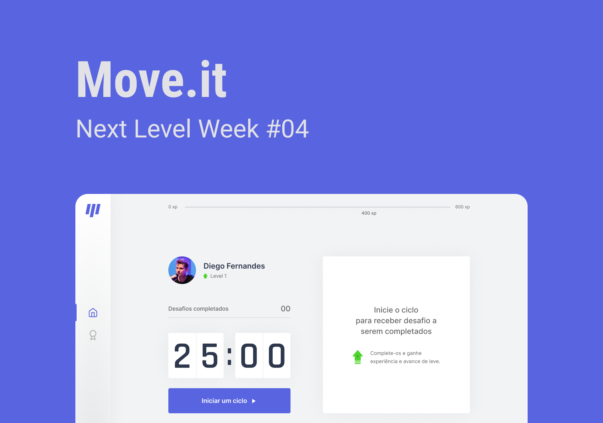

<h1 align="center">
  
</h1>

  <!-- <a href="https://artursantiago.github.io/move.it">Live</a>&nbsp;&nbsp;&nbsp;|&nbsp;&nbsp;&nbsp; -->
  <a href="#-tecnologias">Tecnologias</a>&nbsp;&nbsp;&nbsp;|&nbsp;&nbsp;&nbsp;
  <a href="#-projeto">Projeto</a>&nbsp;&nbsp;&nbsp;|&nbsp;&nbsp;&nbsp;
  <a href="#-layout">Layout</a>&nbsp;&nbsp;&nbsp;|&nbsp;&nbsp;&nbsp;
  <a href="#memo-licença">Licença</a>

 

  

 

  

## 🚀 Tecnologias

Esse projeto foi desenvolvido com as seguintes tecnologias:

- Typescript
- React
- Next.js

## 💻 Projeto

O Move.it é uma aplicação gameficada que visa ajudar devs que passam horas sentados de frente ao computador.

## 🔖 Layout

Você pode visualizar o layout do projeto através [desse link](https://www.figma.com/file/gnCkW2RNKxGiD00dBoxwyg/Move.it-1.0-Copy?node-id=149898%3A199). É necessário ter conta no [Figma](https://figma.com) para acessá-lo.

## :memo: Licença

Esse projeto está sob a licença MIT. Veja o arquivo [LICENSE](LICENSE) para mais detalhes.

---

Feito com ♥ by Rocketseat e Artur Santiago :wave: [Participe da nossa comunidade!](https://discordapp.com/invite/gCRAFhc)
